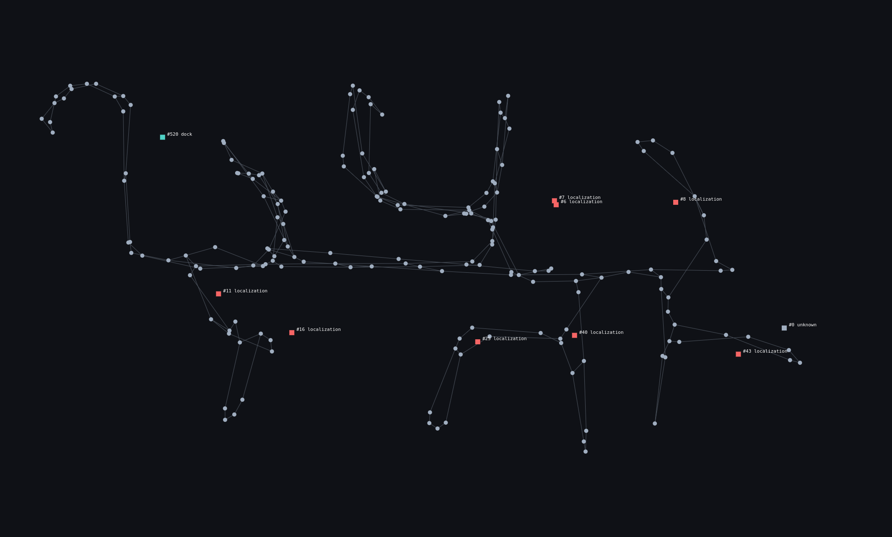
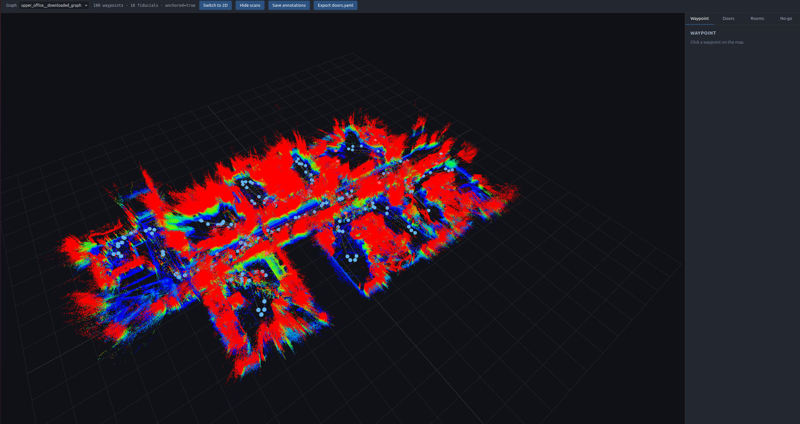

# graphnav_viz

A browser-based annotation app for Boston Dynamics **GraphNav** maps.



It reads a graph that was already recorded (with `graph_nav_command_line` or
Autowalk), renders it as an interactive 2D / 3D map, and lets you enrich it
with metadata that downstream tasks consume:

- **Doors** — per-fiducial form (handle type, swing, hinge, tag→handle offset,
  nearest waypoint). Exports to a YAML file consumed by a fiducial-driven
  door-opening client.
- **Waypoint POIs** — rename, tag, free-text notes per waypoint.
- **Rooms** — polygons named on the floorplan that group waypoints. Lets a
  planner answer "go to the kitchen" by picking any waypoint inside.
- **No-go zones** — polygons rendered as overlay, exported for planners.

Annotations live in a sidecar `annotations.json` next to the graph; the
recorded graph itself is never modified.

## Install

```bash
pip install fastapi uvicorn pyyaml pydantic numpy bosdyn-client
```

(Or pin to your SDK version: `bosdyn-client==5.1.4`.)

## Quick start

From the repo root:

```bash
PYTHONPATH=src python -m graphnav_viz.server
# open http://127.0.0.1:8000
```

The default config looks in `./recorded_graphs/` for any directory containing
a `graph` proto file (walks up to 2 levels deep).

## Config file

Server settings and graph locations can be written to
`graphnav_viz.yaml` (loaded automatically from the cwd, or via `--config`):

```yaml
# Parent directory scanned for graphs. null disables scanning.
graphs_root: recorded_graphs

# Explicit graphs (override discovered ones on name collision). Useful for
# graphs outside graphs_root, e.g. a network share.
graphs:
  - name: warehouse
    path: /mnt/share/spot_maps/warehouse_v2
  - name: lab
    path: ~/spot/lab_graph

server:
  host: 127.0.0.1
  port: 8000
```

CLI flags override config values: `--config`, `--graphs`, `--host`, `--port`.

A complete example lives at `../../graphnav_viz.example.yaml`.

## Annotations sidecar

Saved as `<graph_dir>/annotations.json`:

```json
{
  "doors": [
    {"tag_id": 23, "name": "lab_door", "tag_to_handle": [0, 0, 0.12],
     "handle_type": "lever", "swing": "pull", "hinge": "right",
     "nav_waypoint": "lab-entrance", "approach_standoff_m": 1.0}
  ],
  "waypoint_pois": {
    "<wp_id>": {"name": "charging-dock", "tags": ["dock"], "notes": ""}
  },
  "rooms": [
    {"name": "kitchen", "polygon_seed": [[x, y], ...], "waypoints": ["<wp_id>", ...]}
  ],
  "no_go_zones": [
    {"name": "fragile-shelf", "polygon_seed": [[x, y], ...]}
  ]
}
```

### Fiducial categorization

Boston Dynamics reserves AprilTag id ranges for specific functions. The app
classifies every fiducial in the graph and only allows tags in the
**localization** range to become doors. Other ranges render as info-only.

| Range | Category | Door eligible? |
|---|---|---|
| 1–299 | `localization` | ✅ |
| 520–549 | `dock` | ❌ |
| 580–584 | `dock_station` | ❌ |
| 585–586 | `mission_interrupt` | ❌ |
| else | `unknown` | ❌ |

See `loader.fiducial_category` for the source of truth.

## API

| Method | Path | Purpose |
|---|---|---|
| GET | `/api/graphs` | List graphs (name + path). |
| GET | `/api/graphs/{name}` | Waypoints / edges / fiducials / bounds in seed frame. |
| GET | `/api/graphs/{name}/all_points` | Float32 XYZ buffer of every snapshot's feature cloud, transformed into the seed frame. Cached. |
| GET | `/api/graphs/{name}/pointcloud/{snapshot_id}` | Single waypoint's feature cloud, in sensor frame. |
| GET | `/api/graphs/{name}/annotations` | Current sidecar contents. |
| PUT | `/api/graphs/{name}/annotations` | Atomic replace of sidecar (writes to `.tmp` then renames). |
| POST | `/api/graphs/{name}/export/doors` | Save annotations and export `<graph>/doors.yaml`. |

## UI tour

| 2D with scans | 3D with scans |
|---|---|
|  |  |

- **Top bar** — graph dropdown, view toggle, "Show scans", "Save annotations",
  "Export doors.yaml".
- **2D map (default)** — pan with drag, zoom with scroll. Edges as gray lines,
  waypoints as filled circles (blue if POI'd), fiducials as colored squares
  with `#id category` labels. Doors get a yellow ring.
- **"Show scans"** — fetches the union of all snapshot point clouds (in seed
  frame), colors by Z (blue floor → green mid → red ceiling), and paints them
  as an underlay in 2D and as `THREE.Points` in 3D. ~30 MB request for a
  ~180-waypoint graph; cached after the first load.
- **3D view** — three.js scene with the same primitives plus a floor grid.
  Click a waypoint to lazy-load its individual snapshot point cloud.
- **Sidebar tabs**:
  - *Waypoint*: rename / tag / notes the selected waypoint.
  - *Doors*: grouped by fiducial category. Localization tags get a "Mark as
    door" button; once marked, the full edit form appears.
  - *Rooms*: "+ New room" → click vertices on the map → double-click to
    close → name it. Waypoint membership auto-fills via point-in-polygon.
  - *No-go*: same polygon flow.

## Integration

The exported `doors.yaml` is consumed directly by
[`spot_arm_door_fiducial`](../spot_arm_door_fiducial/), a fiducial-driven
automated door opener:

```bash
PYTHONPATH=src python -m spot_arm_door_fiducial.cli $SPOT_IP \
    --config recorded_graphs/<your_graph>/doors.yaml --door <name>
```

The integration is one-way (this app writes; the door opener reads). You can
use this app standalone — without `spot_arm_door_fiducial`, the doors tab
just records annotated YAML.

## Layout

| File | Purpose |
|---|---|
| `server.py` | FastAPI app + endpoints, CLI entry point |
| `config.py` | `AppConfig` schema + YAML loader |
| `loader.py` | Graph proto parsing, anchored layout, fiducial categorization, point-cloud transforms — no VTK |
| `schema.py` | Pydantic models for `annotations.json` |
| `export.py` | Annotations → `doors.yaml` |
| `static/` | Vanilla HTML + JS frontend (`app.js`, `map2d.js`, `map3d.js`, `style.css`, `index.html`) |

No build step on the frontend; three.js loads from a CDN via import map.

## Roadmap

- **Local-grid heightmap overlay** — each waypoint snapshot has 5 × 128×128
  grids (`terrain`, `obstacle_distance`, `no_step`, …). Decoding and
  projecting these into a stitched floor heightmap would give a sharper
  floor-plan look than the feature cloud underlay.
- **Multi-user editing** — currently single-user; no locking on
  `annotations.json`.
- **Robot live overlay** — show the robot's localized pose on the map in
  real time (would require a SDK connection alongside the offline graph).

## License

This package is built on top of the Boston Dynamics Spot SDK, which is
distributed under the [Boston Dynamics Software Development Kit License
(20191101-BDSDK-SL)](../../LICENSE). Use of this package is therefore subject
to that license.
